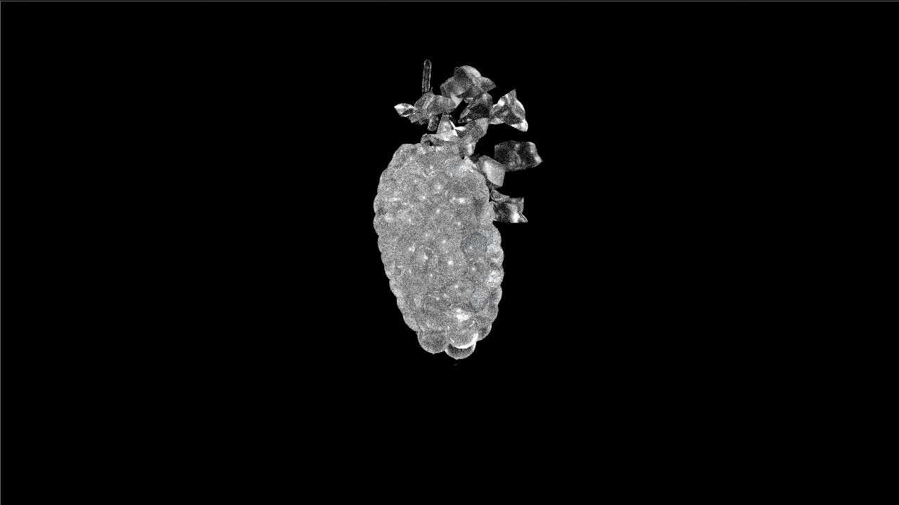
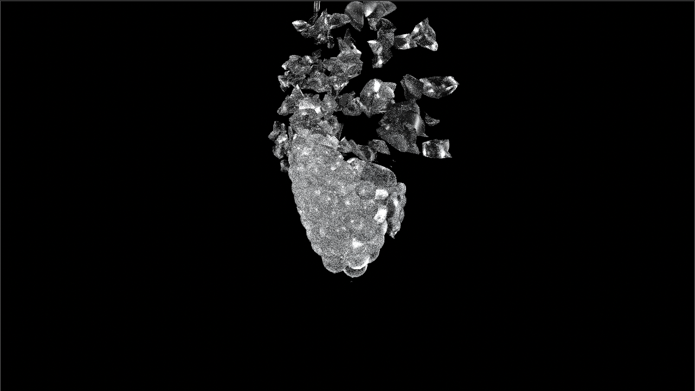
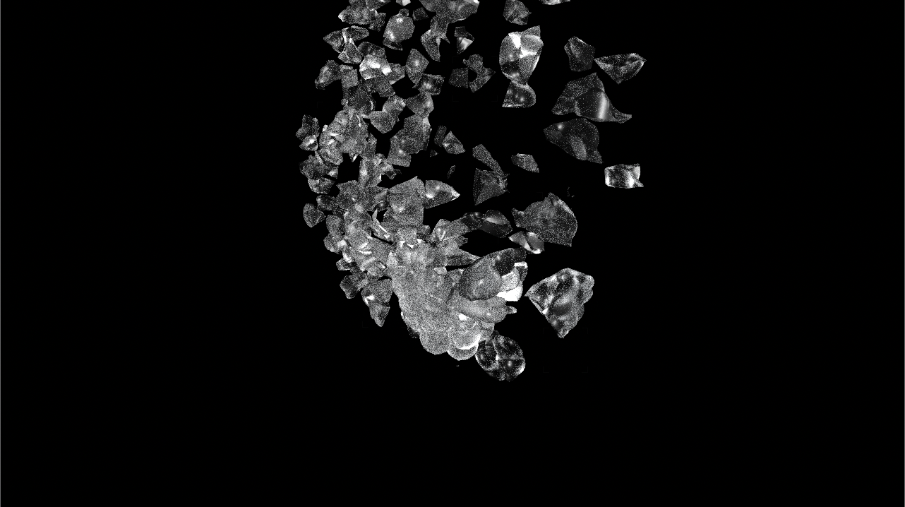
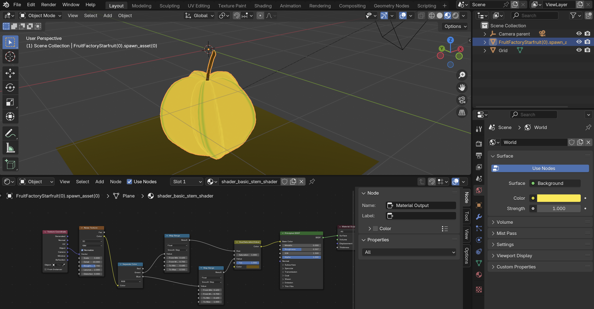
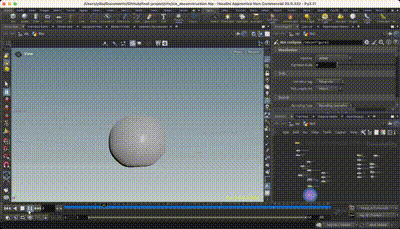

# Fractured Frost: Procedural Ice Destruction Objects

## Project Introduction
The theme of this project revolves around the **transformation of natural elements**, focusing on the creation and procedural destruction of ice objects in a virtual environment. By utilizing **Infinigen's procedural generation techniques**, the project crafts intricate and photorealistic ice models and integrates them into **Houdini** for spectacular visual effects that simulate realistic ice destruction. 

## Overview
This project develops a pipeline that:
1. Utilizes **Infinigen's algorithm** to procedurally generate custom objects.
2. Integrates these objects into **Houdini** for advanced visual effects.
3. Simulates and renders **realistic ice destruction**, capturing fine details like cracking, shattering, and fracturing dynamics.

## Key Features
- **Procedural Generation**: Using Infinigen’s open-source algorithms to create highly detailed, customizable ice assets.
- **Houdini VFX**: Leveraging Houdini’s node-based simulation tools to design and control ice destruction effects.
- **Pipeline Integration**: Connecting Infinigen-generated assets to Houdini’s workflow for efficiency and scalability.
- **Realism**: Achieving photorealistic results through precise control of materials, lighting, and physics simulations.

## Tools and Technologies
- **Infinigen**: For procedural 3D asset generation.
- **Houdini**: For virtual effects and simulation of ice destruction.
- **Blender/Other 3D Tools**: (Optional) For preprocessing or additional customization.

## Pipeline Steps
1. **Asset Creation**: Generate ice objects using procedural tools, ensuring high fidelity and geometric detail.
2. **Data Export**: Export the generated ice models in compatible formats (e.g., OBJ, FBX) for Houdini.
3. **Import and Setup**: Import ice models into Houdini, applying materials and setting up physical properties (e.g., brittleness, density).
4. **Destruction Simulation**: Use Houdini’s dynamics to simulate ice breaking, shattering, and fragmenting under various forces.

### Results

### Future Work
Material Diversity: Extend the pipeline to include other natural materials such as glass, stone, or wood, creating a library of destructible objects with unique physical and visual properties.

Language Model Integration: Utilize language models to automate the creation of Python scripts. By interpreting natural language input, users could generate scripts that seamlessly integrate text-based asset creation into the pipeline, from model generation to VFX simulation.

## Milestone 1: Paper Review and Read Existing Codes of infiniGen
Read papers to understand the prinnciples and genrated objects. Modified and expand the existing code to procedurally generate a greater variety of objects.

## Milestone 2: Writing python scripts to create assets 
Python scripts were developed to procedurally generate new assets based on customizable parameters. These scripts were designed to create variations of existing models by altering attributes such as size, texture, and geometry. Rigorous testing ensured the generated assets were compatible with the rest of the pipeline and met high standards of quality.

Outcome:

## Milestone 3: Adding the VFX effects throguh Houdini 
The generated assets were successfully imported into Houdini, where complex destruction simulations were set up. These simulations included scenarios such as ice shattering under force, enhanced by advanced particle systems, lighting, and material shaders. High-quality renders of these effects were produced, showcasing the visual realism and dynamic interactions of the assets.

## Final Presentation
https://docs.google.com/presentation/d/14sXtjkUZFXSBM1hpwnsDEF9ewEJZqxyJ7Fv0qX9AlGg/edit#slide=id.p 

## Potential Applications
Film and Animation: Utilize the pipeline to create visually stunning ice destruction scenes, enhancing narratives with realistic environmental interactions.

Gaming: Integrate destructible ice environments into games, allowing players to interact with dynamic scenes and solve puzzles based on material properties.

## Reference 
- Infinigen Project: https://infinigen.org

- Raistrick, A., Lipson, L., Ma, Z., Mei, L., Wang, M., Zuo, Y., Kayan, K., Wen, H., Han, B., Wang, Y., Newell, A., Law, H., Goyal, A., Yang, K., & Deng, J. (2023). [Infinite Photorealistic Worlds using Procedural Generation](https://arxiv.org/abs/2306.09310). *Proceedings of the IEEE/CVF Conference on Computer Vision and Pattern Recognition (CVPR)*, 12630–12641.

- Raistrick, A., Mei, L., Kayan, K., Yan, D., Zuo, Y., Han, B., Wen, H., Parakh, M., Alexandropoulos, S., Lipson, L., Ma, Z., & Deng, J. (2024). [Infinigen Indoors: Photorealistic Indoor Scenes using Procedural Generation](https://arxiv.org/abs/2406.11824). *Proceedings of the IEEE/CVF Conference on Computer Vision and Pattern Recognition (CVPR)*, 21783–21794.

- Houdini Documentation: https://www.sidefx.com/docs/houdini/

- Blender: https://www.blender.org

